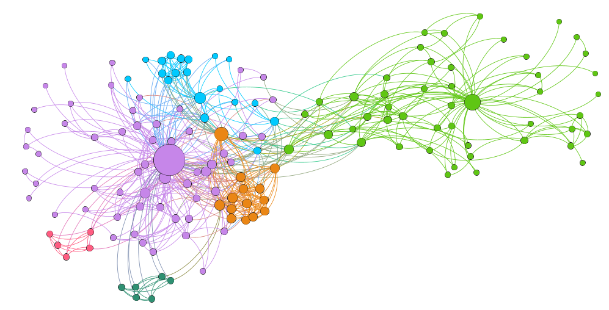
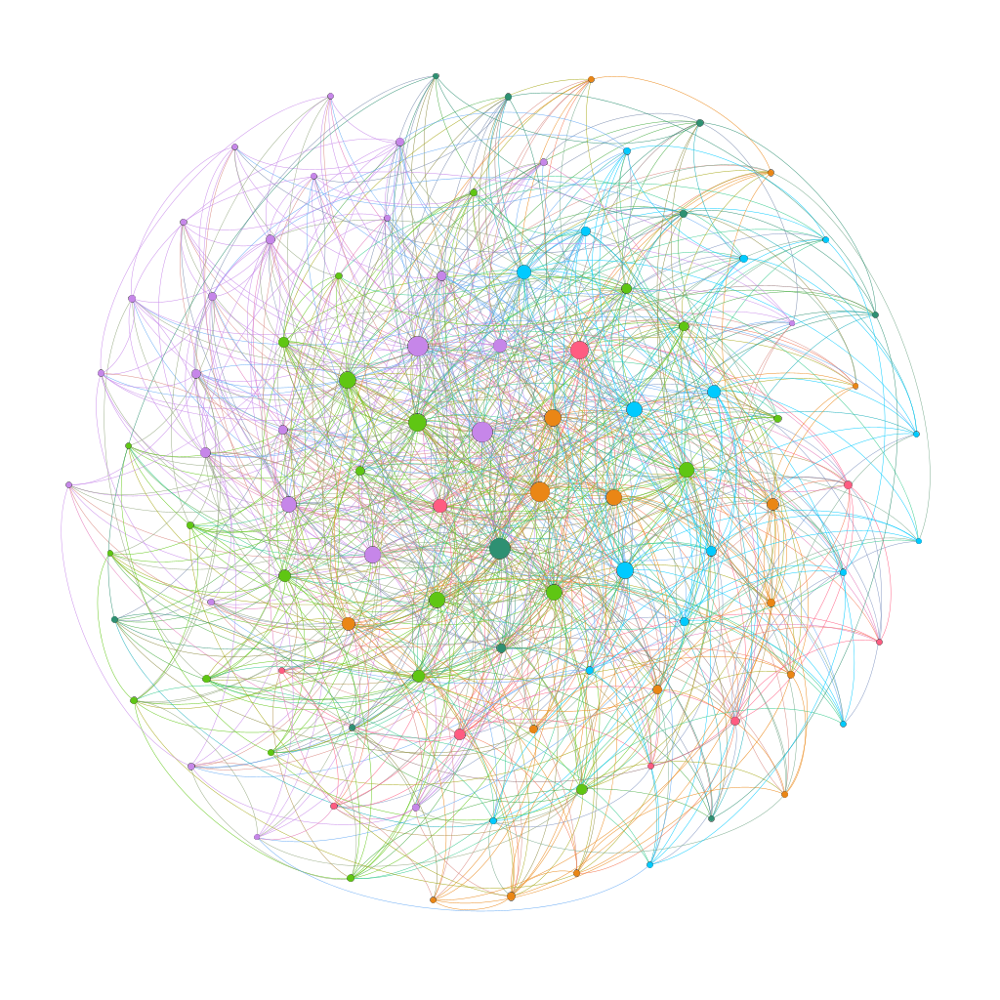
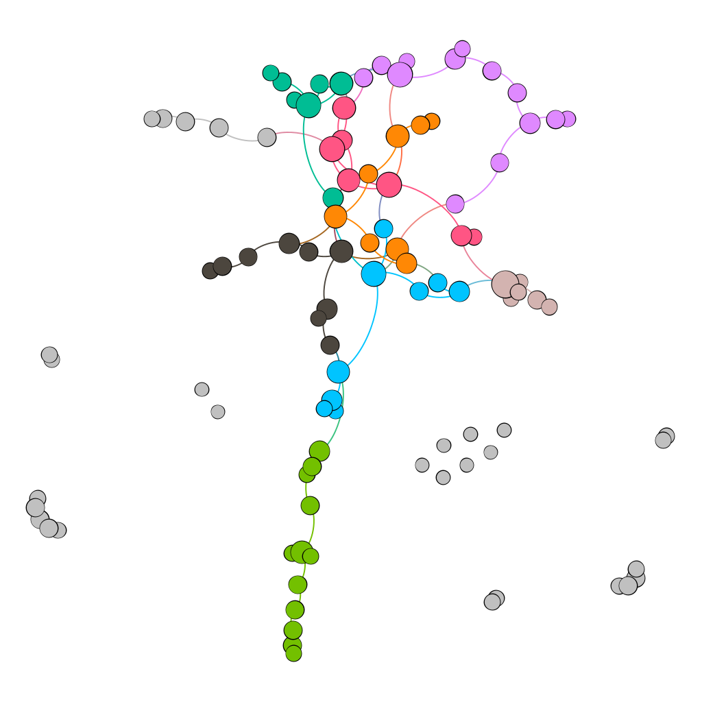

# TASK1
*How many nodes and links does DBLP have?*
Nodes=149, Links=633

*Does the network have a clear community structure?*

# TASK2
*Open the _Poisson-2.NET and _Pref-attach-3.NET files generated by the script,
and create nice visualizations of them with Gephi.*
## Poissson2

## Pref_attach

*Look at the degree distributions and information files (*info.txt) saved by SNAP.*
amazon:
  Nodes:                    262111
  Edges:                    899792

facebook:
  Nodes:                    4039
  Edges:                    88234

Python type PNGraph:
  Nodes:                    100
  Edges:                    945

DBLP:
  Nodes:                    2553470
  Edges:                    14322115

*For the DBLP, inspect the length of shortest paths between some pairs of nodes. Conclusion?*

For 3 of the 25 iterations there existed no path. Only two add 7 steps and the rest were between 4-6, so the concept of six degrees of separation works pretty well in science world as well.

# TASK3

Got the same number of triangles and number of edges but it took alot longer time with code i did myself. Around 10 times slower

Number of triangles 717719
Number of wedges 9120350
time snap:  0:00:01.264183
717719.0
9120350.0
time self:  0:00:13.607649