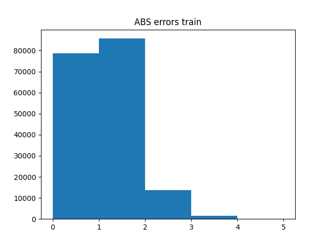
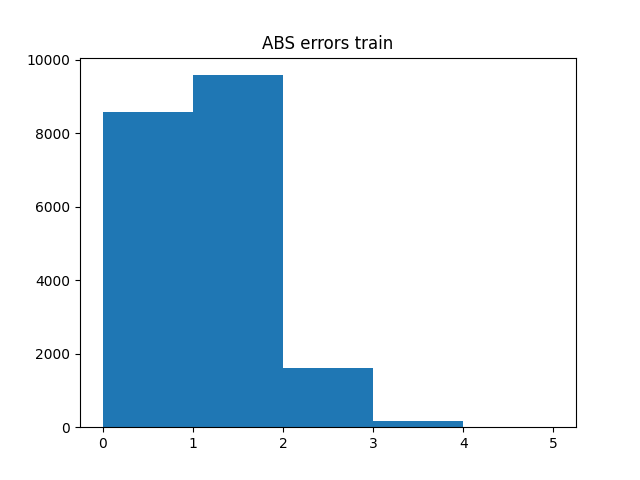

# TASK 1

## RMSE baseline
* frena297.training = 0.880
* frena297.test = 0.892
* task---2.training = 0.886
* task---2.test = 0.901
* verification.training = 0.891
* verification.test = 0.905

# TASK 2

## RMSE neighborhood
umin = 40, L = 200

* frena297.training = 0.556
* frena297.test = 0.881
* task---2.taining = 0.561
* task--2.test = 0.890
* verification.training = 0.546
* verification.test = 0.890

improvement frena297 1.2%
improvement task--2 1.2%
improvement verification 1.7 %