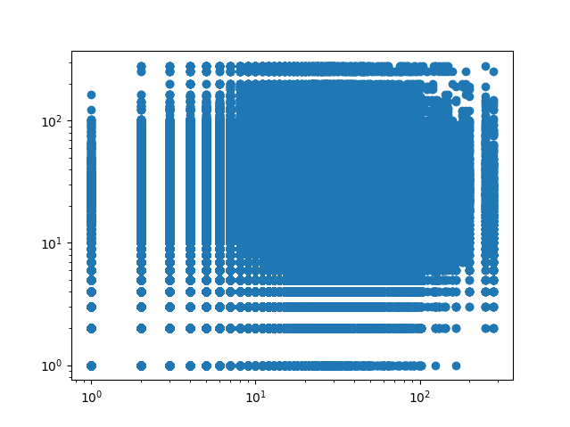
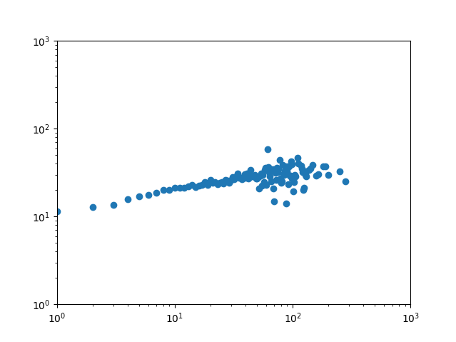
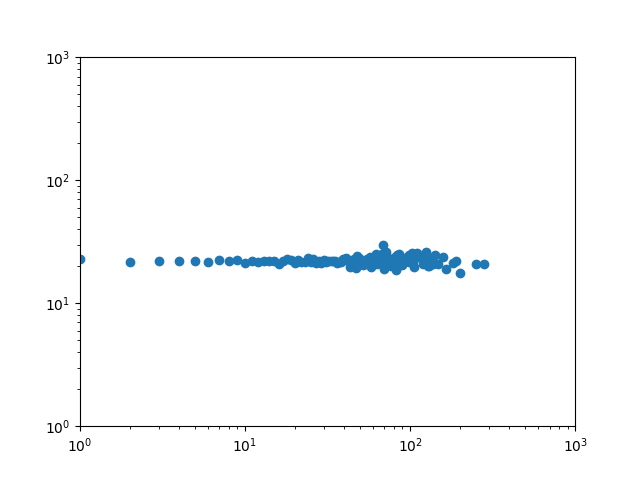
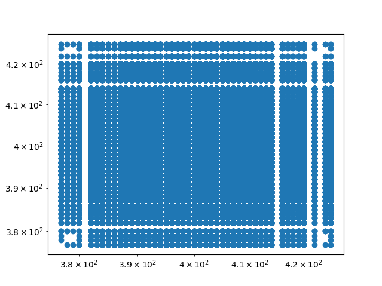
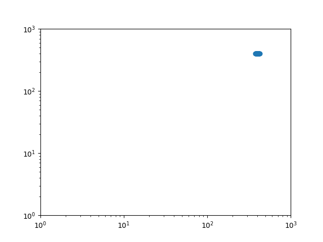
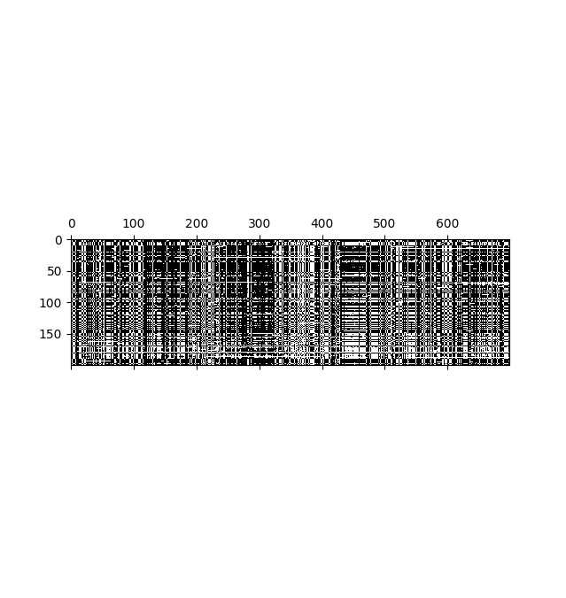
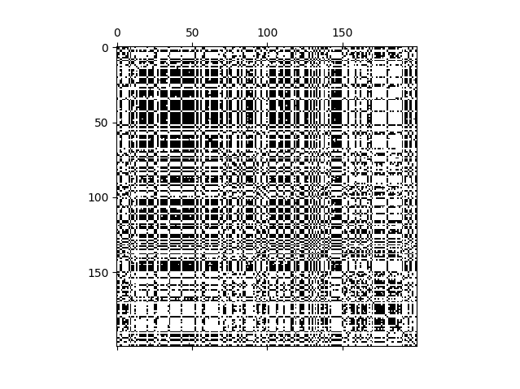
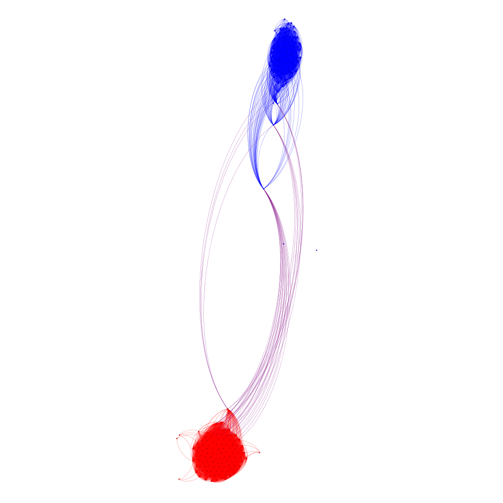
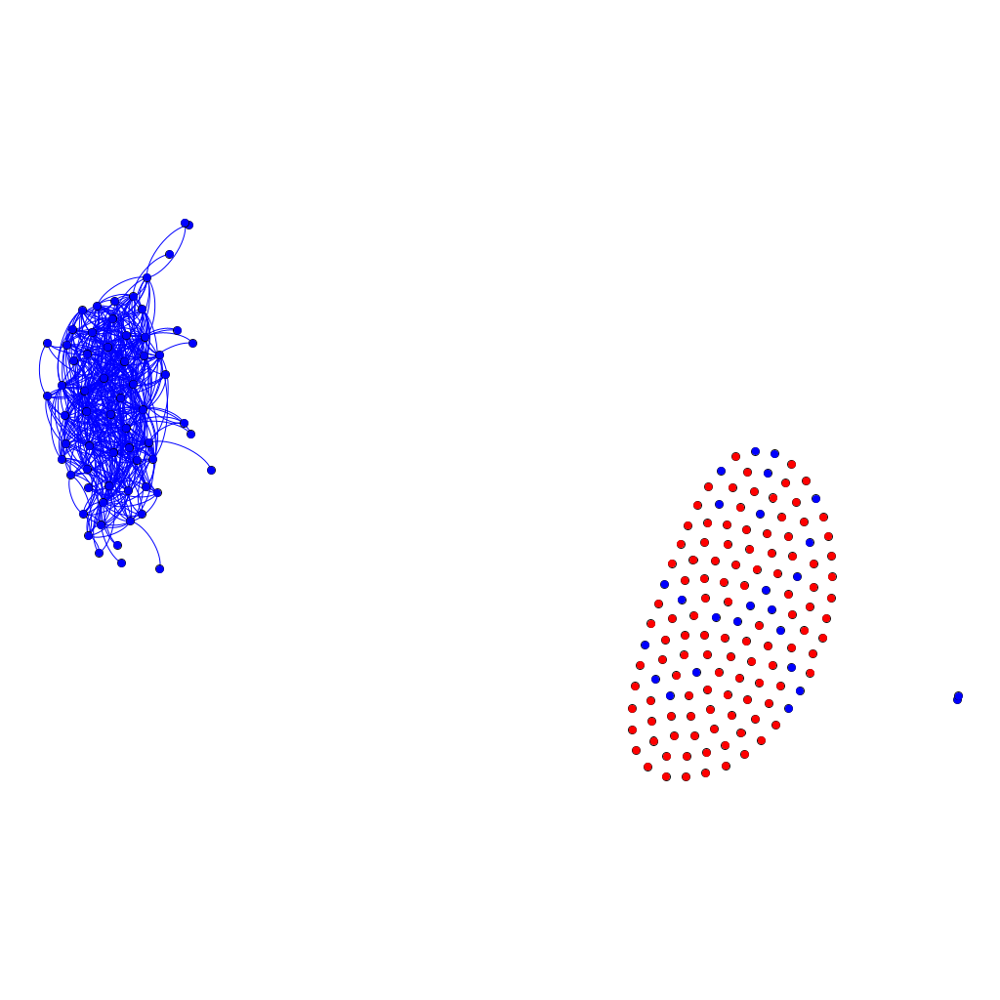
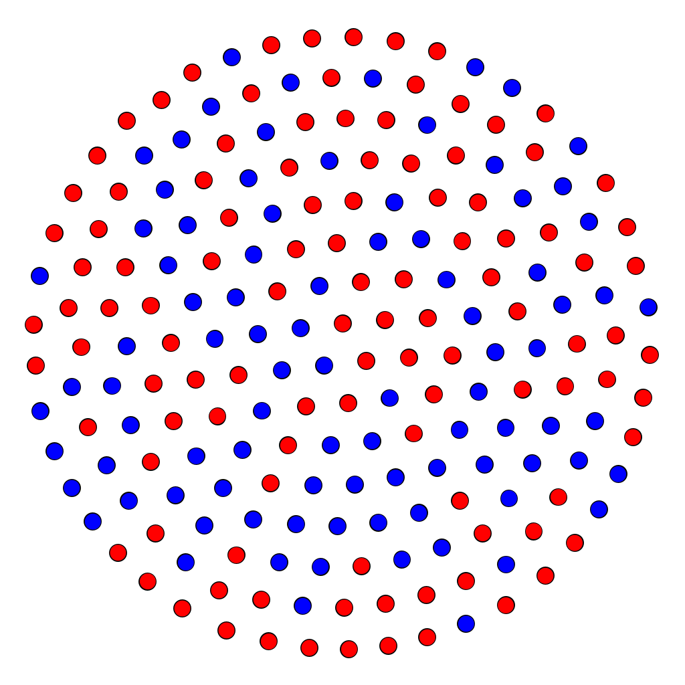

## TASK 1
Clustering for each node, 

The degree distribution of a network tells us the probability that a randomly chosen node will have degree k. A scale free network will have a almost straight line since it is log. Scale-free networks are a type of network characterized by the presence of large hubs. A scale-free network is one with a power-law degree distribution.

N1: nodes with high degrees have a tendency to get lower clustering coefficients indicating that they act as bridges between different neighborhoods. Average node degree around 10. Erdös-Renyi networks since they follow the poisson distributions.

N2: Very similar to N2.

N3: Most likely scale free network, few are highly connected follows the power law curve. Linear in loglog. exonent around 1

N4: Star network, one node has 499 degree and the rest only have one.

N5: All nodes have the same degrees 7. 500 nodes, very hard to tell what type of graph it is. Not scale free or ER

N6: A complete graph, all nodes are connected to each other

N7: Most likely scale free network, few are highly connected follows the power law curve. Linear in loglog. exponent less than 1

N8: Degree distribution is similar to N2 but doesnt have as many different amount degrees. ER

## TASK2

The triangles are sampled by randomly selecting a node and then choosing two of its neighbors. This sampling method introduces bias because the probability of selecting a particular triangle is influenced by the degree distribution of nodes in the network. Nodes with high degree are more likely to be selected

tot number edges = 711210
tot number pos edges = 589888/711210 = 83%
to number neg edges = 118619/711210 = 17%

yes i would say so, only one triangle was unbalanced

## TASK 3
Definition 4.1 (Small-world behaviour) We say that a network exhibits a small-world behaviour if the characteristic path length L grows proportionally to the logarithm of the number of nodes N in the network.

Diameter: The length of the longest shortest path between all possible pairs of nodes,

1: 224.75 and 6.58 after rewire, when increasing N to 1000*100 we got 22499 and 10.74 after rewiring. Not small world diameter increases linearly as the nodes increases.

2: 58.42389758179232 and 6.576 after rewire,  when increasing N to 1000*100 we got 82.6132 and 10.74 after rewiring. Small world increases but more log proportional.

3: 11.113 and 6.525 after rewire, when increasing N to 1000*100 we got 18.498 and 10.629 after rewiring. Small world increases but more log proportional.

4: 5.428826847690984 and 5.694431562210149, when increasing N to 1000*100 we got 4.8197 and 4.850 after rewiring. Ultra small diameter scales as ln ln N.

5: 10.72 and 6.689 after rewiring. Average degree of 6.88 and clust coefficient of 0.43. I would say it could be small world since the average path is pretty low and the clustering coefficient is pretty high. Like real life small world, clusters of people in different regions

## TASK 4

degree correlation coefficient:  0.1339549839528233
indicates some correlation between nodes with similar degrees but nowhere near perfect assortativity
plot_degreepairs(G) 

We se that it is more common for high degree nodes to be connected with each other, makes sense!

plot_dcf(G)
dcf shows that most nodes have neighbors with similar degrees

degree correlation coefficient:  -0.0002935212919101382
looks like horizontal line at around the same level as the average degree 22. No increase in connection between nodes with the same degree

For the random network we see from the degree pairs that all degrees are connected to eachother. We can also see that all nodes have high degrees. Average degree is 400.

Small horizontal line indicating the correlation is around 0

## TASK 5
Shows how senators have voted, can see some patterns like how usually voted. What proposals went through and more. 

Shows correlation between different senators

Show clusters labeled as republicans and democrats

By increasing regularization we get less non-zero elems in precision matrix

change regularization to 0.2

change regularization to 0.5

pink = 4
these are the coloring
if v[n]==0:
    color_r=255
elif v[n]==1:
    color_b=255
elif v[n]==2:
    color_r=255
    color_b=255
elif v[n]==3:
    color_g=255
elif v[n]==4:
    color_r=255
    color_g=255

BRCA is red
COAD is blue
KIRC is pink
LUAD is green
PRAD is yellow

All but the BRCA, COAD and LUAD seem to be pretty tightly connected while KIRC and PRAD is not equally as similar.